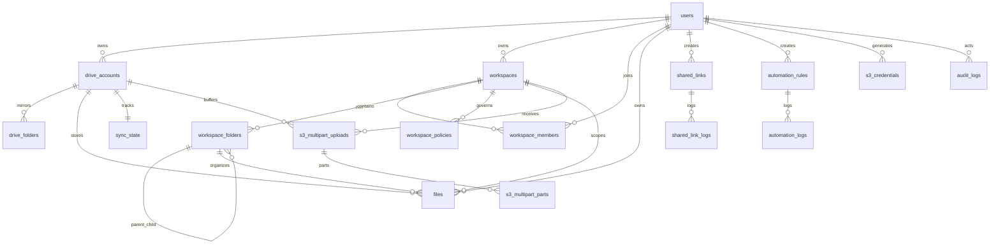

# SCHEMA.md — Database Schema (Cloudflare D1)

Database OmniDrive menggunakan **Cloudflare D1** (SQLite). Skema master ada di `packages/worker/src/db/schema.sql`. Migrasi dijalankan lewat **wrangler native migrations** dari folder `packages/worker/migrations/` (lihat `#migrasi`).

## Diagram Relasi



## Tabel

### `users`

Akun lokal dan Google OAuth.

| Kolom | Tipe | Keterangan |
|-------|------|------------|
| `id` | TEXT PK | UUID |
| `username` | TEXT UNIQUE | Login username |
| `password_hash` | TEXT | PBKDF2 hash (`pbkdf2:iters:salt:hash`); `'oauth_only_user'` untuk user OAuth-only |
| `google_id` | TEXT UNIQUE | Google subject ID (nullable) |
| `email` | TEXT UNIQUE | Email (nullable) |
| `name` | TEXT | Display name |
| `avatar_url` | TEXT | URL avatar |
| `is_super_admin` | INTEGER | `1` = super admin, `0` = member |
| `created_at` | TEXT | ISO datetime |
| `updated_at` | TEXT | ISO datetime |

**Role global**: `super_admin` | `member` (di session, bukan kolom terpisah selain `is_super_admin`).

---

### `drive_accounts`

Akun Google Drive yang terhubung per user.

| Kolom | Tipe | Keterangan |
|-------|------|------------|
| `id` | TEXT PK | UUID |
| `user_id` | TEXT FK → users | Pemilik |
| `google_account_id` | TEXT | ID akun Google |
| `email` | TEXT | Email akun Drive |
| `name` | TEXT | Nama tampilan |
| `type` | TEXT | `'oauth'` atau `'service_account'` |
| `is_primary` | INTEGER | Drive utama |
| `root_folder_id` | TEXT | Folder root (shared drive / subfolder) |
| `total_quota` | INTEGER | Kuota total (bytes) — dari Google API bila tersedia |
| `used_quota` | INTEGER | Kuota terpakai (bytes) — `storageQuota.usageInDrive` |
| `quota_override` | INTEGER | **Deprecated (tidak ditulis lagi).** Override kapasitas manual (bytes). NULL/0 = tidak ada. Fitur editor manual dihapus; branch di `computeDriveQuota` tetap read-only. |
| `quota_updated_at` | TEXT | Terakhir update kuota |
| `created_at` | TEXT | |

**Unique**: `(user_id, google_account_id)`

---

### `drive_folders`

Mirror struktur folder Google Drive (read-only cache).

| Kolom | Tipe | Keterangan |
|-------|------|------------|
| `id` | TEXT PK | |
| `drive_account_id` | TEXT FK | |
| `google_folder_id` | TEXT | ID folder di Google |
| `google_parent_id` | TEXT | Parent di Google |
| `name` | TEXT | |
| `is_synced` | INTEGER | Status sync |
| `synced_at` | TEXT | |

**Unique**: `(drive_account_id, google_folder_id)`

---

### `workspaces`

Ruang kolaborasi tim (menggantikan virtual folders).

| Kolom | Tipe | Keterangan |
|-------|------|------------|
| `id` | TEXT PK | Juga digunakan sebagai **S3 bucket name** |
| `name` | TEXT | Nama workspace |
| `owner_id` | TEXT FK → users | |
| `used_bytes` | INTEGER | Pemakaian storage |
| `sync_ttl_minutes` | INTEGER | Default `5` — TTL cache sync |
| `created_at` | TEXT | |
| `updated_at` | TEXT | |

---

### `workspace_members`

Keanggotaan dan RBAC workspace.

| Kolom | Tipe | Keterangan |
|-------|------|------------|
| `id` | TEXT PK | |
| `workspace_id` | TEXT FK | |
| `user_id` | TEXT FK | |
| `role` | TEXT | `viewer`, `commenter`, `editor`, `manager`, `auditor`, `owner` |
| `joined_at` | TEXT | |

**Unique**: `(workspace_id, user_id)`

**Hierarki role** (tinggi → rendah): `owner` > `manager` > `auditor` > `editor` > `commenter` > `viewer`

---

### `workspace_folders`

Struktur folder internal OmniDrive (bukan folder Google).

| Kolom | Tipe | Keterangan |
|-------|------|------------|
| `id` | TEXT PK | |
| `workspace_id` | TEXT FK | |
| `name` | TEXT | |
| `parent_id` | TEXT FK → self | Nullable = root |
| `icon` | TEXT | Emoji/icon |
| `color` | TEXT | Warna label |
| `is_starred` | INTEGER | |
| `metadata` | TEXT | JSON string, default `'{}'` |
| `last_synced_at` | TEXT | |
| `sync_status` | TEXT | `idle`, `syncing`, dll. |
| `created_at` | TEXT | |
| `updated_at` | TEXT | |

**Unique**: `(workspace_id, parent_id, name)`

---

### `files`

Metadata file yang disinkronkan dari Google Drive.

| Kolom | Tipe | Keterangan |
|-------|------|------------|
| `id` | TEXT PK | |
| `user_id` | TEXT FK | |
| `drive_account_id` | TEXT FK | |
| `google_file_id` | TEXT | ID file di Google |
| `workspace_id` | TEXT FK | Nullable — file di workspace |
| `workspace_folder_id` | TEXT FK | Nullable |
| `google_parent_id` | TEXT | Parent folder di Google |
| `name` | TEXT | |
| `mime_type` | TEXT | |
| `size` | INTEGER | Bytes |
| `thumbnail_url` | TEXT | |
| `web_view_link` | TEXT | |
| `web_content_link` | TEXT | |
| `is_trashed` | INTEGER | |
| `is_starred` | INTEGER | |
| `metadata` | TEXT | JSON custom metadata |
| `google_created_at` | TEXT | |
| `google_modified_at` | TEXT | |
| `last_synced_at` | TEXT | |
| `sync_status` | TEXT | |
| `synced_at` | TEXT | |
| `created_at` | TEXT | |
| `updated_at` | TEXT | |

**Unique**: `(drive_account_id, google_file_id)`

**Indeks**: `user_id+workspace_id`, `workspace_folder_id`, `drive_account_id`, `name`, `google_parent_id`

---

### `sync_state`

State sinkronisasi per drive account.

| Kolom | Tipe | Keterangan |
|-------|------|------------|
| `drive_account_id` | TEXT PK FK | |
| `change_token` | TEXT | Google Changes API token |
| `next_page_token` | TEXT | Checkpoint pagination (resume-able sync) |
| `last_synced_at` | TEXT | |
| `status` | TEXT | `idle`, `syncing`, `error` |
| `error_message` | TEXT | |

---

### `shared_links`

Tautan berbagi file/folder publik.

| Kolom | Tipe | Keterangan |
|-------|------|------------|
| `id` | TEXT PK | |
| `user_id` | TEXT FK | Pemilik |
| `target_type` | TEXT | `'file'` atau `'folder'` |
| `target_id` | TEXT | ID target |
| `password_hash` | TEXT | Opsional |
| `expires_at` | TEXT | |
| `allow_downloads` | INTEGER | Default `1` |
| `allow_uploads` | INTEGER | Default `0` |
| `max_downloads` | INTEGER | |
| `require_email` | INTEGER | |
| `webhook_url` | TEXT | Callback setelah akses |
| `view_count` | INTEGER | |
| `download_count` | INTEGER | |
| `created_at` | TEXT | |

---

### `s3_lifecycle_rules`

Aturan lifecycle bucket S3 (bucket = workspace). "Expire" = pindah objek ke **trash** Google Drive (recoverable ~30 hari), **bukan** hard delete. Dijalankan oleh cron `*/30`.

| Kolom | Tipe | Keterangan |
|-------|------|------------|
| `id` | TEXT PK | |
| `workspace_id` | TEXT FK | Bucket = workspace, `ON DELETE CASCADE` |
| `prefix` | TEXT | Prefix objek, default `''` (semua) |
| `expiration_days` | INTEGER | Umur file (hari) sebelum di-trash |
| `enabled` | INTEGER | Default `1` |
| `created_at` | TEXT | |

`UNIQUE(workspace_id, prefix)` — satu rule per prefix per bucket.

---

### `shared_link_logs`

Log akses shared link.

| Kolom | Tipe | Keterangan |
|-------|------|------------|
| `id` | INTEGER PK AUTO | |
| `shared_link_id` | TEXT FK | |
| `action` | TEXT | `view`, `download`, dll. |
| `visitor_email` | TEXT | |
| `created_at` | TEXT | |

---

### `automation_rules`

Aturan automasi file.

| Kolom | Tipe | Keterangan |
|-------|------|------------|
| `id` | TEXT PK | |
| `user_id` | TEXT FK | |
| `name` | TEXT | |
| `trigger_type` | TEXT | Jenis trigger |
| `trigger_config` | TEXT | JSON |
| `conditions` | TEXT | JSON |
| `actions` | TEXT | JSON |
| `is_active` | INTEGER | |
| `created_at` | TEXT | |
| `updated_at` | TEXT | |

---

### `automation_logs`

Log eksekusi automasi.

| Kolom | Tipe | Keterangan |
|-------|------|------------|
| `id` | TEXT PK | |
| `rule_id` | TEXT FK | |
| `status` | TEXT | `success`, `failed`, dll. |
| `details` | TEXT | JSON |
| `executed_at` | TEXT | |

---

### `audit_logs`

Audit trail aksi workspace.

| Kolom | Tipe | Keterangan |
|-------|------|------------|
| `id` | TEXT PK | |
| `workspace_id` | TEXT FK | Nullable |
| `actor_id` | TEXT FK → users | |
| `action_type` | TEXT | |
| `resource_id` | TEXT | |
| `resource_name` | TEXT | |
| `metadata` | TEXT | JSON |
| `created_at` | TEXT | |

Retensi: dibersihkan otomatis setelah 30 hari (cron).

---

### `workspace_policies`

Kebijakan kuota dan retensi data.

| Kolom | Tipe | Keterangan |
|-------|------|------------|
| `id` | TEXT PK | |
| `workspace_id` | TEXT FK | |
| `target_type` | TEXT | `'workspace'` atau `'folder'` |
| `target_id` | TEXT FK | Folder target (nullable) |
| `policy_type` | TEXT | `'storage_quota'` atau `'data_retention'` |
| `config` | TEXT | JSON konfigurasi |
| `created_at` | TEXT | |
| `updated_at` | TEXT | |

---

### `invitation_codes`

Kode undangan registrasi user baru.

| Kolom | Tipe | Keterangan |
|-------|------|------------|
| `id` | TEXT PK | |
| `code` | TEXT UNIQUE | |
| `created_by` | TEXT FK → users | |
| `max_uses` | INTEGER | Default `1` |
| `used_count` | INTEGER | |
| `expires_at` | TEXT | |
| `created_at` | TEXT | |

---

### `sessions`

Session login user (migrated from KV to D1 in the baseline migration `0001_initial_schema.sql`).

| Kolom | Tipe | Keterangan |
|-------|------|------------|
| `id` | TEXT PK | Session ID (cookie `omnidrive_sid`) |
| `user_id` | TEXT FK → users | Pemilik session |
| `data` | TEXT | JSON `SessionData` |
| `expires_at` | INTEGER | Unix ms — session invalid jika < `now` |
| `touched_at` | INTEGER | Unix ms — diupdate max 1x/jam (throttled sliding window) |

Cleanup: cron `*/30` di `index.ts` menghapus baris `WHERE expires_at < now`.

---

### `oauth_states`

PKCE verifier + userId untuk OAuth round-trip (migrated from KV to D1 in the baseline migration `0001_initial_schema.sql`). TTL 10 menit, dibersihkan cron.

| Kolom | Tipe | Keterangan |
|-------|------|------------|
| `state` | TEXT PK | Random UUID — OAuth state parameter |
| `code_verifier` | TEXT | PKCE code verifier |
| `user_id` | TEXT | User yang memulai OAuth (dibaca di callback) |
| `created_at` | INTEGER | Unix ms — cleanup `WHERE created_at < now - 10min` |

### `drive_tokens`

OAuth tokens terenkripsi per drive account (migrated from KV to D1 in the baseline migration `0001_initial_schema.sql`). Auto-delete saat drive dihapus (ON DELETE CASCADE).

| Kolom | Tipe | Keterangan |
|-------|------|------------|
| `drive_account_id` | TEXT PK FK → drive_accounts | Drive yang punya token |
| `encrypted_tokens` | TEXT | Ciphertext AES-256-GCM dari JSON `OAuthTokens` |
| `updated_at` | INTEGER | Unix ms — timestamp write terakhir |

### `quota_cache`

Cache hasil `storageQuota` Google Drive API (migrated from KV to D1 in the baseline migration `0001_initial_schema.sql`). TTL 5 menit via `updated_at` check di kode.

| Kolom | Tipe | Keterangan |
|-------|------|------------|
| `drive_account_id` | TEXT PK FK → drive_accounts | Drive yang di-cache |
| `payload` | TEXT | JSON `QuotaCache` (v, total, used, hasLimit) |
| `updated_at` | INTEGER | Unix ms — entry dianggap stale jika > 5min / >1h (cron) |

---

### `s3_credentials`

Kredensial API key kompatibel S3 per user.

| Kolom | Tipe | Keterangan |
|-------|------|------------|
| `id` | TEXT PK | |
| `user_id` | TEXT FK | |
| `access_key_id` | TEXT UNIQUE | Prefix `OMNI...` |
| `secret_key_enc` | TEXT | Secret terenkripsi |
| `description` | TEXT | Label user |
| `workspace_id` | TEXT FK | `NULL` = global; terisi = scoped ke workspace |
| `created_at` | TEXT | |

---

### `s3_multipart_uploads`

Upload multipart aktif (buffer di Google Drive).

| Kolom | Tipe | Keterangan |
|-------|------|------------|
| `upload_id` | TEXT PK | |
| `user_id` | TEXT FK | |
| `workspace_id` | TEXT FK | Bucket/workspace |
| `key` | TEXT | Object key |
| `drive_account_id` | TEXT FK | Drive untuk buffer |
| `temp_folder_id` | TEXT | Folder temp di Google Drive |
| `created_at` | TEXT | |

---

### `s3_multipart_parts`

Part individual dari multipart upload.

| Kolom | Tipe | Keterangan |
|-------|------|------------|
| `upload_id` | TEXT FK | |
| `part_number` | INTEGER | |
| `google_file_id` | TEXT | File part di Drive |
| `etag` | TEXT | MD5 hex |
| `size` | INTEGER | |
| `created_at` | TEXT | |

**PK**: `(upload_id, part_number)`

---

## Migrasi

Mulai session ini, migrasi memakai **wrangler native D1 migrations** (`wrangler d1 migrations apply`), bukan lagi `wrangler d1 execute --file=schema.sql`. Wrangler melacak migrasi yang sudah diterapkan di tabel `d1_migrations`, sehingga tiap file dijalankan **tepat sekali** dan kolom baru pada tabel lama benar-benar ter-apply (memperbaiki drift lama di mana `schema.sql` yang penuh `IF NOT EXISTS` tak pernah menjalankan `ALTER TABLE`).

Folder migrasi: `packages/worker/migrations/`. Sumber tunggal kebenaran.

| File | Perubahan |
|------|-----------|
| `0001_initial_schema.sql` | Baseline idempoten — salinan `schema.sql` (semua tabel + index). `apply` pertama di DB production yang sudah ada = no-op aman (semua `IF NOT EXISTS`), sekadar mencatat baseline. |

Migrasi lama bernomor `0001`–`0010` di `src/db/` (dead, tak dirujuk kode manapun) dan `migrations/0008_add_s3_lifecycle_rules.sql` (tabrakan nomor `0008`) sudah dihapus — semua efeknya sudah ada di baseline. Riwayat tersimpan di git.

**Aturan ke depan:** setiap perubahan skema wajib update DUA hal — `src/db/schema.sql` (canonical fresh-install, dipakai `reset.mjs`/`onboard-deploy.mjs`) **dan** file `migrations/000N_*.sql` baru berisi DDL incremental. Test `tests/migrations.test.ts` gagal bila keduanya divergen.

> **Catatan drift production:** baseline idempoten aman sebagai no-op, tapi TIDAK menyembuhkan drift lama (mis. kolom `is_super_admin` yang tak pernah ter-apply di prod). Verifikasi kolom prod (`wrangler d1 execute omnidrive --remote --command "PRAGMA table_info(users)"`) lalu, bila ada kolom hilang, tulis migrasi rekonsiliasi `000N_*.sql` — `ALTER TABLE ADD COLUMN` tidak idempoten, jadi harus ditulis sesuai state prod aktual (keputusan maintainer).

## Perintah Database

```bash
# Apply migrasi (fresh install & incremental)
make db-migrate-local     # development → wrangler d1 migrations apply omnidrive --local
make db-migrate-remote    # production  → wrangler d1 migrations apply omnidrive --remote

# Factory reset (hapus semua data, re-apply schema.sql penuh)
make reset-local
make reset-remote
```

## KV Store (Bukan D1)

Setelah migrasi KV→D1 (baseline `0001_initial_schema.sql`), hampir semua data sudah pindah ke D1. KV hanya menyimpan **rate-limit counter shared link** (volume rendah, TTL semantics convenient):

| Key pattern | Isi |
|-------------|-----|
| `shared_verify_lock:{linkId}` | Lockout setelah 20x password salah (TTL 15 menit) |
| `shared_verify_fail:{linkId}` | Counter percobaan gagal (TTL 15 menit) |

Token OAuth, PKCE state, dan quota cache sudah di D1 (tabel `drive_tokens`, `oauth_states`, `quota_cache`).