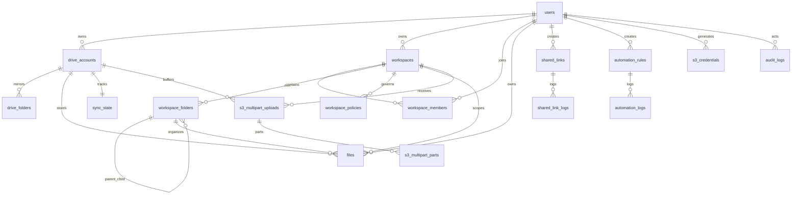

# SCHEMA.md — Database Schema (Cloudflare D1)

OmniDrive uses **Cloudflare D1** (SQLite). The master schema lives in `packages/worker/src/db/schema.sql`. Migrations are applied via **wrangler native migrations** from `packages/worker/migrations/` (see `#migrations`).

## Relationship Diagram



## Tables

### `users`

Local and Google OAuth accounts.

| Column | Type | Description |
|--------|------|-------------|
| `id` | TEXT PK | UUID |
| `username` | TEXT UNIQUE | Login username |
| `password_hash` | TEXT | PBKDF2 hash (`pbkdf2:iters:salt:hash`); `'oauth_only_user'` for OAuth-only users |
| `google_id` | TEXT UNIQUE | Google subject ID (nullable) |
| `email` | TEXT UNIQUE | Email (nullable) |
| `name` | TEXT | Display name |
| `avatar_url` | TEXT | Avatar URL |
| `is_super_admin` | INTEGER | `1` = super admin, `0` = member |
| `created_at` | TEXT | ISO datetime |
| `updated_at` | TEXT | ISO datetime |

**Global role**: `super_admin` | `member` (in the session, not a separate column other than `is_super_admin`).

---

### `drive_accounts`

Connected Google Drive accounts per user.

| Column | Type | Description |
|--------|------|-------------|
| `id` | TEXT PK | UUID |
| `user_id` | TEXT FK → users | Owner |
| `google_account_id` | TEXT | Google account ID |
| `email` | TEXT | Drive account email |
| `name` | TEXT | Display name |
| `type` | TEXT | `'oauth'` or `'service_account'` |
| `is_primary` | INTEGER | Primary drive |
| `root_folder_id` | TEXT | Root folder (shared drive / subfolder) |
| `total_quota` | INTEGER | Total quota (bytes) — from Google API when available |
| `used_quota` | INTEGER | Used quota (bytes) — `storageQuota.usageInDrive` |
| `quota_override` | INTEGER | **Deprecated (no longer written).** Manual capacity override (bytes). NULL/0 = none. Manual editor feature removed; the branch in `computeDriveQuota` remains read-only. |
| `quota_updated_at` | TEXT | Last quota update |
| `created_at` | TEXT | |

**Unique**: `(user_id, google_account_id)`

---

### `drive_folders`

Mirror of Google Drive folder structure (read-only cache).

| Column | Type | Description |
|--------|------|-------------|
| `id` | TEXT PK | |
| `drive_account_id` | TEXT FK | |
| `google_folder_id` | TEXT | Folder ID in Google |
| `google_parent_id` | TEXT | Parent in Google |
| `name` | TEXT | |
| `is_synced` | INTEGER | Sync status |
| `synced_at` | TEXT | |

**Unique**: `(drive_account_id, google_folder_id)`

---

### `workspaces`

Team collaboration spaces (replacing virtual folders).

| Column | Type | Description |
|--------|------|-------------|
| `id` | TEXT PK | Also used as the **S3 bucket name** |
| `name` | TEXT | Workspace name |
| `owner_id` | TEXT FK → users | |
| `used_bytes` | INTEGER | Storage usage |
| `sync_ttl_minutes` | INTEGER | Default `5` — sync cache TTL |
| `created_at` | TEXT | |
| `updated_at` | TEXT | |

---

### `workspace_members`

Workspace membership and RBAC.

| Column | Type | Description |
|--------|------|-------------|
| `id` | TEXT PK | |
| `workspace_id` | TEXT FK | |
| `user_id` | TEXT FK | |
| `role` | TEXT | `viewer`, `commenter`, `editor`, `manager`, `auditor`, `owner` |
| `joined_at` | TEXT | |

**Unique**: `(workspace_id, user_id)`

**Role hierarchy** (high → low): `owner` > `manager` > `auditor` > `editor` > `commenter` > `viewer`

---

### `workspace_folders`

Internal OmniDrive folder structure (not Google folders).

| Column | Type | Description |
|--------|------|-------------|
| `id` | TEXT PK | |
| `workspace_id` | TEXT FK | |
| `name` | TEXT | |
| `parent_id` | TEXT FK → self | Nullable = root |
| `icon` | TEXT | Emoji/icon |
| `color` | TEXT | Label color |
| `is_starred` | INTEGER | |
| `metadata` | TEXT | JSON string, default `'{}'` |
| `last_synced_at` | TEXT | |
| `sync_status` | TEXT | `idle`, `syncing`, etc. |
| `created_at` | TEXT | |
| `updated_at` | TEXT | |

**Unique**: `(workspace_id, parent_id, name)`

---

### `files`

File metadata synced from Google Drive.

| Column | Type | Description |
|--------|------|-------------|
| `id` | TEXT PK | |
| `user_id` | TEXT FK | |
| `drive_account_id` | TEXT FK | |
| `google_file_id` | TEXT | File ID in Google |
| `workspace_id` | TEXT FK | Nullable — file in workspace |
| `workspace_folder_id` | TEXT FK | Nullable |
| `google_parent_id` | TEXT | Parent folder in Google |
| `name` | TEXT | |
| `mime_type` | TEXT | |
| `size` | INTEGER | Bytes |
| `thumbnail_url` | TEXT | |
| `web_view_link` | TEXT | |
| `web_content_link` | TEXT | |
| `is_trashed` | INTEGER | |
| `is_starred` | INTEGER | |
| `metadata` | TEXT | JSON custom metadata |
| `google_created_at` | TEXT | |
| `google_modified_at` | TEXT | |
| `last_synced_at` | TEXT | |
| `sync_status` | TEXT | |
| `synced_at` | TEXT | |
| `created_at` | TEXT | |
| `updated_at` | TEXT | |

**Unique**: `(drive_account_id, google_file_id)`

**Indexes**: `user_id+workspace_id`, `workspace_folder_id`, `drive_account_id`, `name`, `google_parent_id`

---

### `sync_state`

Sync state per drive account.

| Column | Type | Description |
|--------|------|-------------|
| `drive_account_id` | TEXT PK FK | |
| `change_token` | TEXT | Google Changes API token |
| `next_page_token` | TEXT | Pagination checkpoint (resume-able sync) |
| `last_synced_at` | TEXT | |
| `status` | TEXT | `idle`, `syncing`, `error` |
| `error_message` | TEXT | |

---

### `shared_links`

Public file/folder sharing links.

| Column | Type | Description |
|--------|------|-------------|
| `id` | TEXT PK | |
| `user_id` | TEXT FK | Owner |
| `target_type` | TEXT | `'file'` or `'folder'` |
| `target_id` | TEXT | Target ID |
| `password_hash` | TEXT | Optional |
| `expires_at` | TEXT | |
| `allow_downloads` | INTEGER | Default `1` |
| `allow_uploads` | INTEGER | Default `0` |
| `max_downloads` | INTEGER | |
| `require_email` | INTEGER | |
| `webhook_url` | TEXT | Callback after access |
| `view_count` | INTEGER | |
| `download_count` | INTEGER | |
| `created_at` | TEXT | |

---

### `s3_lifecycle_rules`

S3 bucket lifecycle rules (bucket = workspace). "Expire" means move the object to Google Drive **trash** (recoverable ~30 days), **not** a hard delete. Run by the `*/30` cron.

| Column | Type | Description |
|--------|------|-------------|
| `id` | TEXT PK | |
| `workspace_id` | TEXT FK | Bucket = workspace, `ON DELETE CASCADE` |
| `prefix` | TEXT | Object prefix, default `''` (all) |
| `expiration_days` | INTEGER | File age (days) before trashing |
| `enabled` | INTEGER | Default `1` |
| `created_at` | TEXT | |

`UNIQUE(workspace_id, prefix)` — one rule per prefix per bucket.

---

### `shared_link_logs`

Shared link access logs.

| Column | Type | Description |
|--------|------|-------------|
| `id` | INTEGER PK AUTO | |
| `shared_link_id` | TEXT FK | |
| `action` | TEXT | `view`, `download`, etc. |
| `visitor_email` | TEXT | |
| `created_at` | TEXT | |

---

### `automation_rules`

File automation rules.

| Column | Type | Description |
|--------|------|-------------|
| `id` | TEXT PK | |
| `user_id` | TEXT FK | |
| `name` | TEXT | |
| `trigger_type` | TEXT | Trigger type |
| `trigger_config` | TEXT | JSON |
| `conditions` | TEXT | JSON |
| `actions` | TEXT | JSON |
| `is_active` | INTEGER | |
| `created_at` | TEXT | |
| `updated_at` | TEXT | |

---

### `automation_logs`

Automation execution logs.

| Column | Type | Description |
|--------|------|-------------|
| `id` | TEXT PK | |
| `rule_id` | TEXT FK | |
| `status` | TEXT | `success`, `failed`, etc. |
| `details` | TEXT | JSON |
| `executed_at` | TEXT | |

---

### `audit_logs`

Workspace action audit trail.

| Column | Type | Description |
|--------|------|-------------|
| `id` | TEXT PK | |
| `workspace_id` | TEXT FK | Nullable |
| `actor_id` | TEXT FK → users | |
| `action_type` | TEXT | |
| `resource_id` | TEXT | |
| `resource_name` | TEXT | |
| `metadata` | TEXT | JSON |
| `created_at` | TEXT | |

Retention: automatically cleaned up after 30 days (cron).

---

### `workspace_policies`

Quota and data retention policies.

| Column | Type | Description |
|--------|------|-------------|
| `id` | TEXT PK | |
| `workspace_id` | TEXT FK | |
| `target_type` | TEXT | `'workspace'` or `'folder'` |
| `target_id` | TEXT FK | Target folder (nullable) |
| `policy_type` | TEXT | `'storage_quota'` or `'data_retention'` |
| `config` | TEXT | JSON configuration |
| `created_at` | TEXT | |
| `updated_at` | TEXT | |

---

### `invitation_codes`

Invitation codes for new user registration.

| Column | Type | Description |
|--------|------|-------------|
| `id` | TEXT PK | |
| `code` | TEXT UNIQUE | |
| `created_by` | TEXT FK → users | |
| `max_uses` | INTEGER | Default `1` |
| `used_count` | INTEGER | |
| `expires_at` | TEXT | |
| `created_at` | TEXT | |

---

### `sessions`

User login sessions (migrated from KV to D1 via `0009`).

| Column | Type | Description |
|--------|------|-------------|
| `id` | TEXT PK | Session ID (cookie `omnidrive_sid`) |
| `user_id` | TEXT FK → users | Session owner |
| `data` | TEXT | JSON `SessionData` |
| `expires_at` | INTEGER | Unix ms — session invalid if < `now` |
| `touched_at` | INTEGER | Unix ms — updated at most 1x/hour (throttled sliding window) |

Cleanup: cron `*/30` in `index.ts` deletes rows `WHERE expires_at < now`.

---

### `oauth_states`

PKCE verifier + userId for OAuth round-trip (migrated from KV via `0010`). TTL 10 minutes, cleaned by cron.

| Column | Type | Description |
|--------|------|-------------|
| `state` | TEXT PK | Random UUID — OAuth state parameter |
| `code_verifier` | TEXT | PKCE code verifier |
| `user_id` | TEXT | User who initiated OAuth (read in callback) |
| `created_at` | INTEGER | Unix ms — cleanup `WHERE created_at < now - 10min` |

### `drive_tokens`

Encrypted OAuth tokens per drive account (migrated from KV via `0010`). Auto-deleted when the drive is removed (ON DELETE CASCADE).

| Column | Type | Description |
|--------|------|-------------|
| `drive_account_id` | TEXT PK FK → drive_accounts | Drive that owns the token |
| `encrypted_tokens` | TEXT | AES-256-GCM ciphertext of the `OAuthTokens` JSON |
| `updated_at` | INTEGER | Unix ms — last write timestamp |

### `quota_cache`

Cache of Google Drive API `storageQuota` results (migrated from KV via `0010`). TTL 5 minutes via `updated_at` check in code.

| Column | Type | Description |
|--------|------|-------------|
| `drive_account_id` | TEXT PK FK → drive_accounts | Drive being cached |
| `payload` | TEXT | JSON `QuotaCache` (v, total, used, hasLimit) |
| `updated_at` | INTEGER | Unix ms — entry considered stale if > 5min / >1h (cron) |

---

### `s3_credentials`

Per-user S3-compatible API key credentials.

| Column | Type | Description |
|--------|------|-------------|
| `id` | TEXT PK | |
| `user_id` | TEXT FK | |
| `access_key_id` | TEXT UNIQUE | Prefix `OMNI...` |
| `secret_key_enc` | TEXT | Encrypted secret |
| `description` | TEXT | User label |
| `workspace_id` | TEXT FK | `NULL` = global; set = scoped to workspace |
| `created_at` | TEXT | |

---

### `s3_multipart_uploads`

Active multipart uploads (buffered in Google Drive).

| Column | Type | Description |
|--------|------|-------------|
| `upload_id` | TEXT PK | |
| `user_id` | TEXT FK | |
| `workspace_id` | TEXT FK | Bucket/workspace |
| `key` | TEXT | Object key |
| `drive_account_id` | TEXT FK | Drive for buffering |
| `temp_folder_id` | TEXT | Temp folder in Google Drive |
| `created_at` | TEXT | |

---

### `s3_multipart_parts`

Individual parts of a multipart upload.

| Column | Type | Description |
|--------|------|-------------|
| `upload_id` | TEXT FK | |
| `part_number` | INTEGER | |
| `google_file_id` | TEXT | Part file in Drive |
| `etag` | TEXT | MD5 hex |
| `size` | INTEGER | |
| `created_at` | TEXT | |

**PK**: `(upload_id, part_number)`

---

## Migrations

Starting this session, migrations use **wrangler native D1 migrations** (`wrangler d1 migrations apply`), no longer `wrangler d1 execute --file=schema.sql`. Wrangler tracks applied migrations in the `d1_migrations` table, so each file runs **exactly once** and new columns on existing tables actually get applied (fixing the old drift where `schema.sql` full of `IF NOT EXISTS` never ran `ALTER TABLE`).

Migration folder: `packages/worker/migrations/`. Single source of truth.

| File | Change |
|------|--------|
| `0001_initial_schema.sql` | Idempotent baseline — a copy of `schema.sql` (all tables + indexes). First `apply` on an existing production DB = safe no-op (all `IF NOT EXISTS`), just records the baseline. |

Old numbered migrations `0001`–`0010` in `src/db/` (dead, not referenced by any code) and `migrations/0008_add_s3_lifecycle_rules.sql` (number `0008` collision) have been removed — all their effects are already in the baseline. History is preserved in git.

**Forward rule:** every schema change must update TWO things — `src/db/schema.sql` (canonical fresh-install, used by `reset.mjs`/`onboard-deploy.mjs`) **and** a new `migrations/000N_*.sql` file with incremental DDL. The `tests/migrations.test.ts` test fails if the two diverge.

> **Production drift note:** the idempotent baseline is safe as a no-op, but does NOT heal old drift (e.g. `is_super_admin` column that was never applied in prod). Verify prod columns (`wrangler d1 execute omnidrive --remote --command "PRAGMA table_info(users)"`), then if any column is missing, write a reconciliation migration `000N_*.sql` — `ALTER TABLE ADD COLUMN` is not idempotent, so it must be written according to the actual prod state (maintainer decision).

## Database Commands

```bash
# Apply migrations (fresh install & incremental)
make db-migrate-local     # development → wrangler d1 migrations apply omnidrive --local
make db-migrate-remote    # production  → wrangler d1 migrations apply omnidrive --remote

# Factory reset (delete all data, re-apply full schema.sql)
make reset-local
make reset-remote
```

## KV Store (Not D1)

Since migration `0010`, almost all data has moved to D1. KV only stores **shared-link rate-limit counters** (low volume, convenient TTL semantics):

| Key pattern | Content |
|-------------|---------|
| `shared_verify_lock:{linkId}` | Lockout after 20 wrong password attempts (TTL 15 minutes) |
| `shared_verify_fail:{linkId}` | Failed attempt counter (TTL 15 minutes) |

OAuth tokens, PKCE state, and quota cache are now in D1 (tables `drive_tokens`, `oauth_states`, `quota_cache`).
